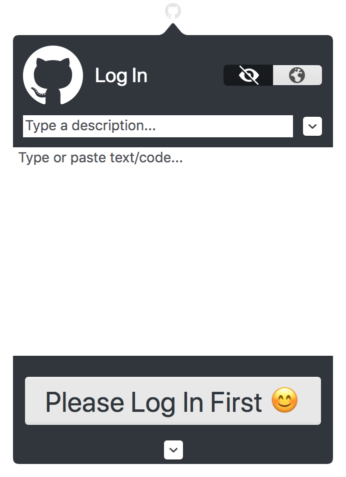
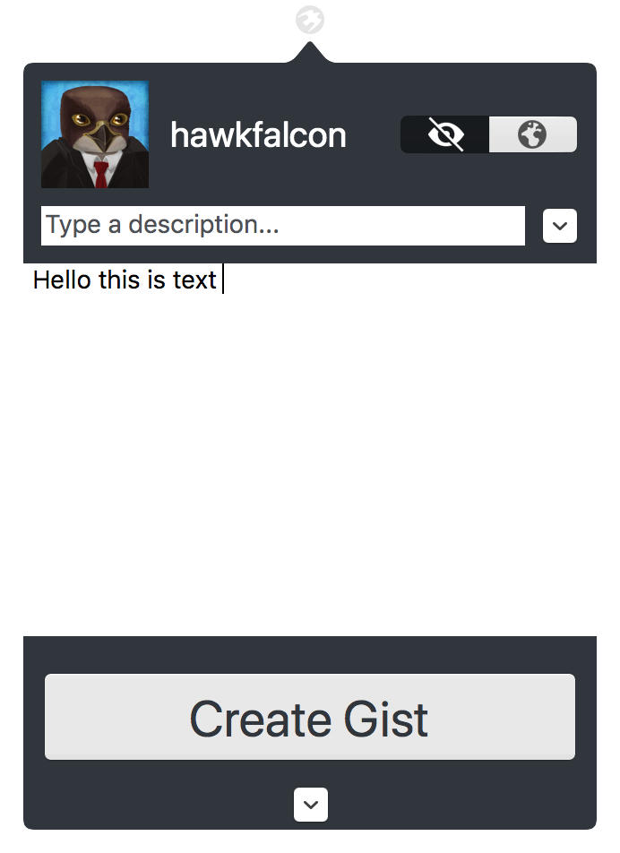
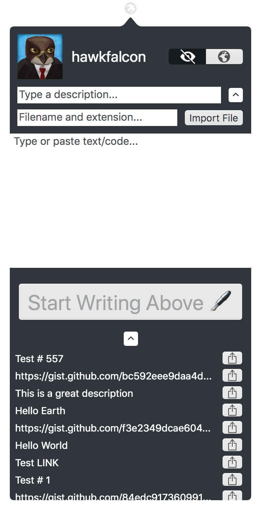
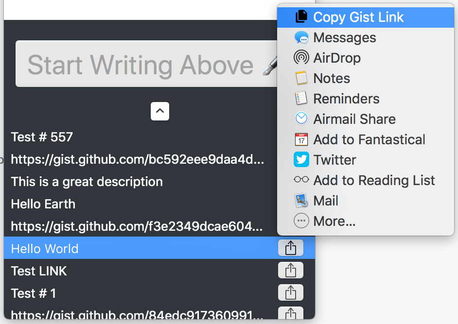

# Peregrine - macOS Gist app

## About 
Peregrine is a free and open source menubar macOS app to instantly share text or code to [gist.github.com](https://gist.github.com).

It is written in Swift 4 and uses Apple's Cocoa API. 

Created for my Senior Project @ Cal Poly SLO

[CustomSharingService](https://github.com/hawkfalcon/CustomSharingService)

[Medium Article](https://medium.com/@hawkfalcon/creating-a-custom-macos-sharing-service-in-swift-e7e0e46cbdd3)

## Features
* Create Gists from the menubar
* Login to your GitHub account
* Browse and share previously created gists
* Make gists public or secret
* Import files

## Design

   
   

    
   

## Contributing
Feel free to contibute by submitting a [pull request](https://github.com/hawkfalcon/Peregrine/pulls)

## License
[MIT](/LICENSE)
